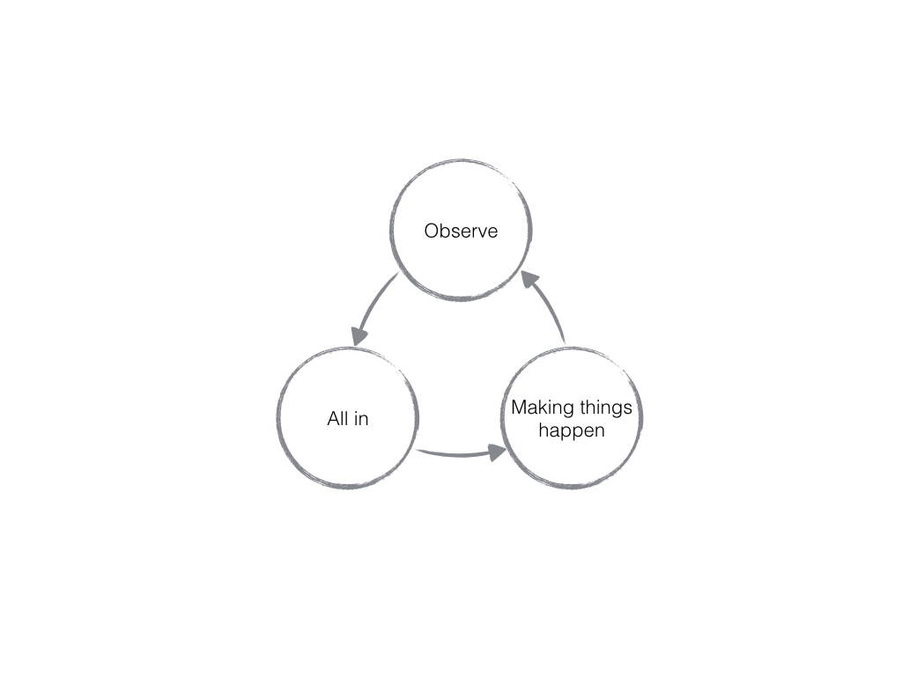

# 斯坦福 CS193P 入门路线

# 路线

1. 主要学习2013-2014秋季斯坦福CS193p《iOS7应用开发》公开课；
2. 辅以学习《Programming with Objective C》、《Objective-C Programming》、《Objective-C程序设计》以及大量网络wiki、技术博客、慕课网视频等以解决看公开课过程中产生的疑问；
3. 总结形式为编写《Sweet Objective-C》书；
4. 入门结束要求为AppStore上线《点滴时间》应用；
5. 计划完成时间为三周（2015年6月15日-2015年7月5日）；

# 思路
思路如下图共有三部分组成，分别是：观察，投入和成果；

### 观察技
 
观察是多么重要的生存技能啊！

可绝大部分人一本子都未点开过**主动观察技**。

当你想要学习和掌握一项技能时，首先要做的不是埋头就干，而是就是尽可能去寻找已经掌握这项技能的人，观察他们是如何学习并最终成功的。

多问问，比如：

* 他们是怎么理解这个问题的？
* 他们用什么工具保持效率的？
* 他们是如何实现这个效果的？
* 他们是如何营销这个产品的？

此处`他们`最好是面对面的自然人，来自书、网络等途径的效果会稍弱。

### 全身心投入

能全身心投入至少需要两个前提：

1. 这门技术对你充满诱惑：可能主要是物质方面，比如能给你带来极大的加薪或者创造新的就业机会；
2. 你能找到办法保持乐趣：因为只要是正常人长年累月都是能学会的，重要的是你能坚持下去，而保持乐趣就是坚持下去的秘密。

### 作品

更加高效的学习我认为是以不断做出产品为目标导向。

真正做出这些成果物，你才能：

1. 学以致用；
2. 证明自己；

我所有的学习都是为了实现某个目的，完成某个作品而来。

在学习iOS的时候，一个很简单的目的就是想把我脑袋里面的产品原型上架到AppStore，然后某天从口袋掏出手机拿给我媳妇看，喏，我写的。

就iOS成果物，最好的莫过于编写自己的App了，同时我还推荐编写博客，并最后最好能汇聚成书，出版。

